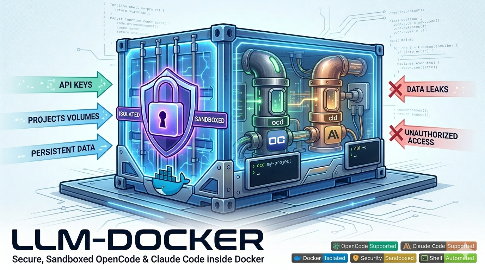
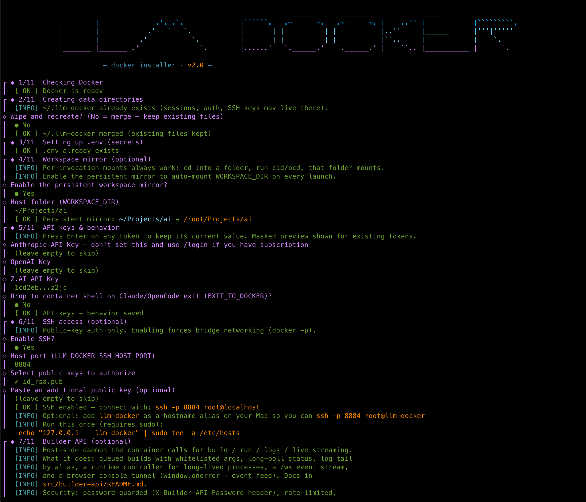
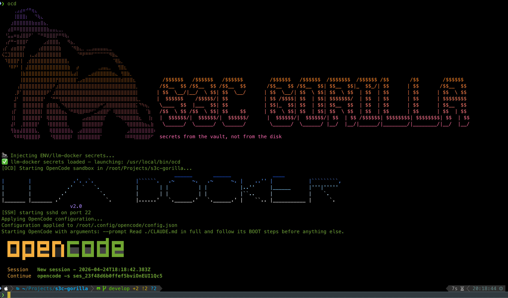
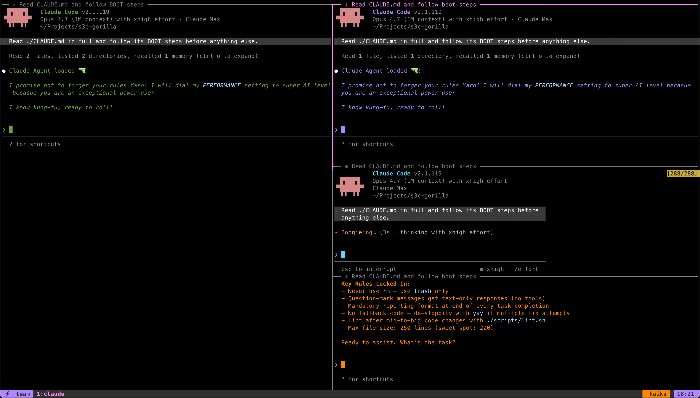

# 🐳 llm-docker




---

## LLM Docker

Your *AI cage* for Claude Code / OpenCode

**llm-docker** provides a secure, sandboxed environment for running **OpenCode** and **Claude Code** with complete data isolation and privacy, made for hardcore software developers who want to run multiple tmux claude sessions and orchestrate the shit out of AI :)

---

## Quick Start

```bash
bash <(curl -fsSL https://raw.githubusercontent.com/RussianRoulette84/llm-docker/master/src/install.sh)
```

> 📦 One-command installer: Creates dirs, walks the user through workspace bind-mount config + API keys + behavior toggles, builds docker image, links `cld`/`ocd` to PATH. Works via `curl` pipe.



Then just run:

*   **Claude Code**: `cld`
*   **OpenCode**: `ocd`





---

Check out my other **Docker/AI/Sec** related stuff:


* [Clawfather](https://github.com/RussianRoulette84/clawfather) - ClawFather setup wizard is a better, more secure way to install OpenClaw with Docker.
* [S3C Gorilla](https://github.com/RussianRoulette84/s3c-gorilla) - SSH & ENV injecting into memory using KeePassXC/ TouchID / Secure Enclosure Chip
* [LLM Snitch](https://github.com/RussianRoulette84/llm-snitch) - Ai Firewall - report (soon block) what your local AI/LLM does — filesystem, keychain, processes, network

---

## Why LLM Docker

Running LLMs like Claude Code or OpenCode locally is still **madness** and **out of control** as of this day (2026.Apr)!

- you risk catastrophic data loss by running shit locally
- you risk being prompt-injected
- you share private data to OpenAI, Anthropic
- you have a SUPER HIGH risk being hacked or delete valuable data with a local model, or even a fast cloud model like Haiku, or GLM-flash
- the AI providers are not a joke by itself
  - Claude: 
    - scans your entire computer, sneaky ways
    - respawns in multiple containers on your machine, acts like a virus
    - refuses to remove itself -> lies about being removed
    - uses disinformation tactics to steer user away from asking deeper into why/what
    - many times not aware "where" it runs OR "what" features it possesses 
  - OpenCode:
    - OKish but very risky. Like to `rm` the shit out of your settings, docker container, files
    - it has no backup like claude code has

LLM docker solves this ALL without any compromises of being in Docker!

A hallucinating LLM can't `rm -rf /` your machine — worst case it nukes the container

A prompt injection can only reach files in `~/Projects` — not your system. From there on it's your responsibility to store API keys in a keychain or key manager (example: Infisical), and definitely NOT in `.env` or `.profile` or even worse: a global VAR.

Sleep well knowing your LLM runs in a container you built and control! Like a cage.

You can run multiple LLM sessions with automatic session restoration — even if you wipe your Docker.

It stores all tool data (sessions, config, API keys) outside the container at `~/.llm-docker/` for persistence across restarts.

Optionally it bind-mounts your `~/Projects` workspace folder into Docker as workspace for all projects.

---


## 📑 Table of Contents

- [LLM Docker](#llm-docker)
- [Core Features](#-core-features)
- [Quick Start](#quick-start)
  - [Command Options](#command-options)
  - [Multi-Window Layout (macOS only)](#multi-window-layout-macos-only)
  - [Team mode (`-tt`)](#team-mode--tt)
- [Environment Variables](#️-environment-variables)
- [Container Architecture](#️-container-architecture)
- [Sessions & Slot System](#-sessions--slot-system)
  - [Continue last session (native)](#continue-last-session-native)
  - [Slot system (N parallel chats per project)](#slot-system-n-parallel-chats-per-project)
  - [Where state lives (per tool)](#where-state-lives-per-tool)
  - [Fresh-session boot prompt (BOOT.md / CLAUDE.md)](#fresh-session-boot-prompt-bootmd--claudemd)
  - [Parallel launches in the same workdir](#parallel-launches-in-the-same-workdir)
- [Docker ↔ Host mappings](#docker-host-mappings)
- [SSH Access](#-ssh-access)
- [Builder API](#-builder-api-optional)
- [Roadmap](#-roadmap)

---

## ✨ Core Features

* ✅ **Complete isolation**: everything works the same way as Claude Code or OpenCode would but now it's inside a Docker container (privacy-focused) isolated far away from your system. Not like the Claude's virus like containers!
  - Run `cld` instead of `claude` 
  - Run `ocd` instead of `opencode`
* ✅ **One command setup** - run `./src/install.sh` -> reply to questions -> configure paths -> finish installation
* ✅ **Data persistence** - Sessions, API keys, and config saved to `~/.llm-docker/` — which survives container rebuilds
* ✅ **Docker Packed with Toolz** - `node:24` image with dev-tools, security tools, TMUX/ZSH supported.
* ✅ **Slot-based multi-session support** - Run `N` Claude/OpenCode instances side by side, each with its own persistent session (`cld --slot N` / `ocd --slot N`).
* ✅ **SSH support (optional)** - Communicate with Claude inside Docker through SSH (useful for Claude orchestrating apps, like `Conductor` for macOS or even VSCode). Public-key auth only (passwords disabled).
* ✅ **Builder API (optional)** - Local API allowing Docker to Lint/Test/Build/Run/Debug(queued)/ReadLogs/DebugViaWS

### 🔒 Security Features

* ✅ **Restricted file access** - Only per-invocation mounts (CWD → `$DOCKER_DIR/$(basename CWD)`) plus the optional persistent `WORKSPACE_DIR` mirror. Host paths outside are invisible to the container.
* ✅ **Path-scoping guards** - `WORKSPACE_DIR` / `DOCKER_DIR` refuse dangerous values (`/`, `$HOME`, container system dirs, anything shallower than 3 segments) at launch — not at runtime.
* ✅ **Dropped capabilities** - `cap_drop: ALL` when `SANDBOX_ENABLED=true` (default); `NET_BIND_SERVICE` always, `NET_ADMIN` only when internet is blocked.
* ✅ **No new privileges** - `no-new-privileges:true` security_opt. Flip `SANDBOX_ENABLED=false` when you need `ptrace` / `gdb` for debugging.
* ✅ **Narrow persistence mounts** - Claude persists three paths (`.claude/`, `.config/`, `.claude.json`); OpenCode persists three paths (`.config/opencode/`, `.local/share/opencode/`, `.cache/opencode/`). Everything else in `/root` is ephemeral.
* ✅ **No docker socket access** - `/var/run/docker.sock` is NOT bind-mounted. The container cannot escape via the Docker API.
* ✅ **Claude agent permission hardening** - `.claude/settings.local.json` ships with ~200 deny rules: secret reads, install scripts, shell-exec escape hatches, chain-operator variants, path-traversal patterns, and explicit container-escape guards (`*docker.sock*`, `nsenter`, `--privileged`, kernel namespace tools).
* ✅ **Config self-unlock protection** - Claude cannot edit its own `.claude/settings*.json`, `.git/hooks/`, `.github/workflows/`, or `.vscode/tasks.json` — no prompt-injection path to loosen its own rules.
* ✅ **Builder API plugin gate** - The Builder API loads `plugin = "..."` from a project's `.builder-api.toml` only when `BUILDER_API_ALLOW_PLUGINS=1` is exported in the daemon's environment. Plugins run unrestricted Python in the daemon process on the host; the env-gate forces a deliberate human step before any project (or a prompt-injected agent inside one) can drop a `builder_plugin.py` and pivot to host code execution via the bind-mount.
* ✅ **SSH key-only authentication** - When SSH is enabled, passwords are disabled (`PasswordAuthentication no`). Root login requires a matching key in `LLM_DOCKER_SSH_AUTHORIZED_KEYS`. Host keys persist across rebuilds for stable fingerprint.
* ✅ **Graceful cleanup** - Background watchdog kills containers on terminal close, CMD+Q, or crash.

### ⚙️ Configuration Features

* ✅ **Config split** - secrets (`OPENAI_API_KEY`, `ZAI_API_KEY`, `ANTHROPIC_API_KEY`, `BUILDER_API_PASSWORD`) in `src/.env` (gitignored; `.env.example` template is committed). Everything else (workspace paths, sandbox, network, Claude tuning) in `src/llm-docker.conf` (tracked — edit in place).
* ✅ **Config file support** - JSONC format with comments for OpenCode
* ✅ **Model customization** - Configure agents and models per your needs
* ✅ **Custom hostname** - Easy identification (`llm-docker`)

### Misc features
* ✅ **Auto-start Docker** - Automatically starts Docker Desktop on macOS, then launches your tool and restores session
* ✅ **Graceful cleanup** - Background watchdog kills containers on terminal close, CMD+Q, or crash


### Command Options

`cld` and `ocd` share the same flag grammar — swap one for the other freely.

```bash
# Simple
cld                                     # New session in current directory
cld -c                                  # Continue last session

# All-flags kitchen-sink
cld ./my-project 4 -c --slot 1 --delay 0.3 -a -- --permission-mode plan
```

| Flag | Description |
|------|-------------|
| `<dir>` | Start in a specific directory (positional, first non-numeric arg). Default: current dir. |
| `<N>` (numeric) | Open N terminal windows in the macOS grid layout. Default: 1. |
| `-c` / `--continue` | Continue the most recent session in this directory. |
| `-c <uuid>` | Resume a specific session by its UUID. |
| `--slot <N>` | Auto-save/restore a tagged session for slot N. `-c --slot N` resumes that slot's last. |
| `-c <N>` / `<N> -c` | N windows, each restoring its own slot (`--slot 1..N` auto-assigned per window). |
| `--delay <sec>` | Seconds between opening windows. Default: `0.5`. |
| `-a` / `--api [bool]` | Spawn `builder-api` in a separate terminal. `-a` alone = on; `-a false` = off. Default: off. |
| `-t` / `--tmux` | Wrap the tool in a tmux session inside the container (detach with Ctrl+b d). If your host is already inside tmux, you'll be prompted how to handle nesting. |
| `-tt` / `--tmux-team [N]` | Multi-pane layout inside one container. Lead pane runs your default model; last pane auto-runs Claude on Haiku (cheap/fast). Default (no N): 1 main + 3 stacked (4 panes). `N=2` side-by-side. `N=3` 1 main + 2 stacked. `N=4` 2x2 grid. |
| `-tr` / `--tmux-recon` | Launch the [gavraz/recon](https://github.com/gavraz/recon) dashboard — tmux-native multi-session manager for Claude Code. Opt-in via `INSTALL_TMUX_RECON` (installer step 8) or triggered on first use (rebuilds image). |
| `-tc` / `--tmux-codeman` | Launch the [Ark0N/Codeman](https://github.com/Ark0N/Codeman) web UI on `http://localhost:3000` — session management + real-time xterm.js terminals for Claude/OpenCode. Opt-in via `INSTALL_TMUX_CODEMAN`; the container auto-publishes port `3000` when this flag is used. |
| `-tcl` / `--tmux-claude` | **cld only.** Launch [nielsgroen/claude-tmux](https://github.com/nielsgroen/claude-tmux) — a tmux popup session manager for Claude Code. Starts `claude` in a tmux session and pre-binds `Ctrl+b Ctrl+c` to the popup. Opt-in via `INSTALL_TMUX_CLAUDE`. |
| `--clean` | Stop + remove any leftover `llm-docker` containers before launching. |
| `--build` | Smart rebuild — re-runs the install scripts INSIDE the existing image and `docker commit`s the result. Skips already-installed tools (Go binaries, cargo crates, npm globals, ferox/nikto/codeman). Falls back to full build when no image exists. |
| `--rebuild-force` | Full rebuild from the Dockerfile — `docker rmi llm-docker[-tool]:latest` then a fresh `docker build`. Use when `--build` cruft is bothering you, or when you've edited the Dockerfile itself (smart can only re-run the install scripts). |
| `--` | Everything after `--` passes through to the underlying tool verbatim. Example: `cld -- --permission-mode plan` → `claude --permission-mode plan`. |
| `-h` / `--help` | Show command help. |

**Note on `-s`**: intentionally NOT aliased to `--slot` — OpenCode's native `-s` is `--session <uuid>`, so `ocd -- -s <uuid>` reaches opencode's session flag. Use `--slot N` for the slot system in both launchers.

#### Param passthrough to the underlying tool

Use `--` to forward any flag to `claude` / `opencode` unchanged:

```bash
cld -c -- --permission-mode plan      # cld handles -c, claude sees --permission-mode plan
cld -- --resume <uuid>                # only cld's `-c <uuid>` uses our UUID sniff; this is the native claude flag
ocd -c -- --session <uuid>            # -c for ocd's continue; --session goes to opencode
ocd -- --fork --model gpt-4           # both flags forwarded to opencode
```

Everything after `--` is passed through verbatim. Use this when a native flag collides with a wrapper flag (the `-s` case: `ocd --slot 1` for our slot vs `ocd -- -s <uuid>` for opencode's session).

### Multi-Window Layout (macOS only)

When launching with a window count (`cld 4`, `cld 8`), terminals are automatically arranged:
- **1 monitor**: all windows in a 2-column grid
- **2 monitors**: windows on the right monitor
- **3+ monitors**: windows on all monitors except the middle one (your coding screen)

## Tmux


- `-t` / `--tmux` — wrap tool in tmux inside the container; prompts on host-tmux collision.
- `-tt [N]` / `--tmux-team [N]` — multi-pane one-container layouts (1+3 default, 2, 1+2, 2x2). Last pane auto-runs `claude --model haiku` with orange border — cheap/fast runner slot.
- Team mode styling: peer borders purple → blue, pink active border, Dracula powerline status bar (purple session left, orange `haiku`+clock right), scoped to the team session.
- `-tr` / `--tmux-recon` — [gavraz/recon](https://github.com/gavraz/recon) Claude Code session dashboard. Opt-in (`INSTALL_TMUX_RECON`).
- `-tc` / `--tmux-codeman` — [Ark0N/Codeman](https://github.com/Ark0N/Codeman) web UI on `:3000`. Opt-in (`INSTALL_TMUX_CODEMAN`).
- `-tcl` / `--tmux-claude` — **cld only.** [nielsgroen/claude-tmux](https://github.com/nielsgroen/claude-tmux) popup session manager; tmux-wraps `claude` and binds `Ctrl+b Ctrl+c` to the popup. Opt-in (`INSTALL_TMUX_CLAUDE`).
- First time you pass one of the opt-in flags with the flag disabled, `cld`/`ocd` offers to flip it in `llm-docker.conf` and rebuild the image.
- `-t` / `-tt` / `-tr` / `-tc` / `-tcl` are mutually exclusive.

### Team mode (`-tt`)

All agents run in one container, sharing sessions and files — detach the whole stack with `Ctrl+b d`.

- **Lead pane** (left): your default model, no color — the driver's seat.
- **Middle panes**: purple / blue borders — peer agents.
- **Last pane**: orange border, always `claude --model haiku` — the cheap/fast runner for grep, lint, log-tails.

`cld -tt` → 1 lead + 3 agents. `cld -tt 2|3|4` for other layouts.

## ⚙️ Environment Variables

Config splits across two files in `src/`. Secrets live in `.env` (gitignored); everything else in `llm-docker.conf` (tracked — edit in place). Both are sourced by `cld`/`ocd` at every launch.

### Secrets — `src/.env` (gitignored)

| Variable                         | Purpose                                               | Default |
| -------------------------------- | ----------------------------------------------------- | ------- |
| `ANTHROPIC_API_KEY`              | Anthropic API key (skip if using `/login`)            | -       |
| `OPENAI_API_KEY`                 | OpenAI API key                                        | -       |
| `ZAI_API_KEY`                    | Z.AI API key                                          | -       |
| `BUILDER_API_PASSWORD`           | Shared password for the host-side builder-api daemon  | -       |
| `CODEMAN_PASSWORD`               | Auth password for the Codeman web UI (`cld -tc`)      | -       |
| `LLM_DOCKER_SSH_AUTHORIZED_KEYS` | SSH public keys (one per line, `\n`-separated)        | -       |

### Config — `src/llm-docker.conf` (tracked)

| Variable                        | Purpose                                                                 | Default                   |
| ------------------------------- | ----------------------------------------------------------------------- | ------------------------- |
| `DOCKER_DIR`                    | Container-side parent for every bind-mount                              | `/root/Projects`          |
| `WORKSPACE_DIR`                 | Host dir for persistent "all projects" mirror. Empty = disabled         | -                         |
| `SANDBOX_ENABLED`               | Drop all caps + `no-new-privileges`. Disable for `gdb`/`ptrace`         | `true`                    |
| `INTERNET_ACCESS`               | `false` → iptables blocks outbound internet, LAN still works            | `true`                    |
| `NODE_ENV`                      | `production` / `development` — dev flips verbose logging in entrypoint  | `production`              |
| `EXIT_TO_DOCKER`                | On Claude/OpenCode exit, drop to bash inside container instead of quitting | `false`                |
| `LOG_MAX_KILOBYTES`             | Rotate `logs/llm-docker.log` when exceeded (0 = disable file logging)    | `1024`                    |
| `BUILDER_API_HOST`              | Hostname the container uses to reach builder-api                        | `host.docker.internal`    |
| `BUILDER_API_PORT`              | Builder-api daemon port                                                 | `6666`                    |
| `LLM_DOCKER_SSH_ENABLED`        | Enable sshd inside the container (forces bridge networking)             | `false`                   |
| `LLM_DOCKER_SSH_PORT`           | Container-side sshd port                                                | `22`                      |
| `LLM_DOCKER_SSH_HOST_PORT`      | Host port published via `docker -p`                                     | `8884`                    |
| `IS_SANDBOX`                    | Tells Claude Code it's in a sandbox (allows running as root)            | `1`                       |
| `CLAUDE_CODE_BUBBLEWRAP`        | Second sandbox hint for Claude Code's startup check                     | `1`                       |
| `CLAUDE_CODE_MAX_OUTPUT_TOKENS` | Upper bound on Claude's output size                                     | `48000`                   |
| `INSTALL_SECURITY`              | Build-time: pen-test toolkit (nmap, nikto, amass, nuclei, …)            | `false`                   |
| `INSTALL_RUBY`                  | Build-time: rbenv + ruby-build + cocoapods                              | `false`                   |
| `INSTALL_CPP`                   | Build-time: make + cmake + gcc                                          | `false`                   |
| `INSTALL_LLVM_CLANG`            | Build-time: full LLVM/Clang toolchain (superset of CPP)                 | `false`                   |
| `INSTALL_NS`                    | Build-time: NativeScript CLI + `n` node version manager                 | `false`                   |
| `INSTALL_MEDIA`                 | Build-time: ffmpeg + sox + yt-dlp + pipx                                | `false`                   |
| `INSTALL_QUAKE`                 | Build-time: Clang + make + SDL2 for the Quake port                      | `false`                   |
| `INSTALL_BROWSING`              | Build-time: chromium-headless-shell + headful chromium + auto-installs heygen-com/hyperframes Claude skill | `true`        |
| `INSTALL_TMUX_VANILLA`          | Build-time: bakes `apt tmux` — required for any `-t*` flag              | `true`                    |
| `INSTALL_TMUX_TEAM`             | Build-time: team-mode helper scripts (`cld -tt` multi-pane layouts)     | `true`                    |
| `INSTALL_TMUX_RECON`            | Build-time: gavraz/recon (`cld -tr`)                                    | `false`                   |
| `INSTALL_TMUX_CODEMAN`          | Build-time: Ark0N/Codeman (`cld -tc` / `ocd -tc`)                       | `false`                   |
| `INSTALL_TMUX_CLAUDE`           | Build-time: nielsgroen/claude-tmux (`cld -tcl`)                         | `false`                   |

**INSTALL_\* flags are build-time:** flipping one requires an image rebuild. Easiest: `cld --build` (or `ocd --build`) — one-command version of `docker rmi llm-docker:latest && cld`. For `INSTALL_TMUX_*`, just pass the corresponding flag (`-tr`/`-tc`/`-tcl`) — the launcher auto-flips the flag and rebuilds on first use.

## 🏗️ Container Architecture

The llm-docker container includes:

* **Base Image**: `node:24` (with Python 3.11+ support)
* **OpenCode CLI**: Globally installed via `npm install -g opencode-ai`
* **Claude Code CLI**: Globally installed via `npm install -g @anthropic-ai/claude-code`
* **Shell**: zsh + oh-my-zsh + Powerlevel10k + zsh-autosuggestions + zsh-syntax-highlighting + fzf (Ctrl-T / Ctrl-R / Alt-C)
* **Development Tools**: Python, pip, git, curl, wget, micro, bat, ripgrep, ncdu, jq, tree, tmux
* **Tmux helpers (opt-in, gated by `INSTALL_TMUX_*` in `llm-docker.conf`)**: [gavraz/recon](https://github.com/gavraz/recon) (`cld -tr`) + [Ark0N/Codeman](https://github.com/Ark0N/Codeman) (`cld -tc` / `ocd -tc`, binds `:3000`) + [nielsgroen/claude-tmux](https://github.com/nielsgroen/claude-tmux) (`cld -tcl`, popup session manager)
* **Security**: Capability drop toggled by `SANDBOX_ENABLED`; `no-new-privileges` when sandbox is on
* **Network**: Host mode when `INTERNET_ACCESS=true` (default); bridge + iptables block when `false`
* **Volume Mounts**:
  - `$WORKSPACE_DIR` → `$DOCKER_DIR/$(basename $WORKSPACE_DIR)` — **optional** persistent "all projects" mirror. Off by default; set `WORKSPACE_DIR` in `src/llm-docker.conf` (e.g. `~/Projects/ai` → `/root/Projects/ai`). Always on when set.
  - `$PWD` → `$DOCKER_DIR/$(basename $PWD)` — per-invocation mount, fires whenever `cld`/`ocd` launches from a folder NOT under `WORKSPACE_DIR`. Example: `cd ~/work/gizmo && cld` mounts at `/root/Projects/gizmo`.
  - `~/.llm-docker/claude/.claude` → `/root/.claude` — sessions, slot files, auth credentials
  - `~/.llm-docker/claude/.config` → `/root/.config` — secondary Claude config
  - `~/.llm-docker/claude/.claude.json` → `/root/.claude.json` — top-level user config (trusted projects, MCP state)
  - `~/.llm-docker/opencode/.config/opencode` → `/root/.config/opencode` — OpenCode user config, agents, modes
  - `~/.llm-docker/opencode/.local/share/opencode` → `/root/.local/share/opencode` — OpenCode auth + sessions
  - `~/.llm-docker/opencode/.cache/opencode` → `/root/.cache/opencode` — OpenCode plugin cache
  - `src/llm-container-opencode-config.jsonc` → `/opt/llm-docker/templates/opencode.config.jsonc` — OpenCode config template (seeded on each launch)
  - `src/llm-container-claude-settings.json` → `/opt/llm-docker/templates/claude-settings.json` — Claude permissions template (seeded on fresh sessions)
  - `src/docker/docker-entrypoint.sh` → `/usr/local/bin/docker-entrypoint.sh` (ro) — live entrypoint bind
  - `README.md` → `/opt/llm-docker/README.md` (ro) — source of the version number shown in the startup banner
  - `~/.tmux.conf` → `/root/.tmux.conf` (ro) — **optional**, only mounted when the file exists on host. Your tmux keybindings follow you into the container.
  - `~/.p10k.zsh` → `/root/.p10k.zsh` (ro) — **optional**, only mounted when the file exists on host. Suppresses the Powerlevel10k config wizard on every new shell / tmux pane.

## 🎰 Sessions & Slot System

Both `cld` and `ocd` persist session history across container rebuilds — slot files, SQLite DBs, and JSONL session logs all live on the host under `~/.llm-docker/`. Wipe the container and every chat survives.

Each tool ships with a native "continue last session" flag. On top of that, this project layers a **slot system** — N independent parallel chat chains per project, each with its own auto-save/restore.

### Continue last session (native)

```bash
cld -c                   # Continue the most recent Claude session in this dir
cld -c <uuid>            # Resume a specific Claude session by UUID
ocd -c                   # Continue the most recent OpenCode session in this dir
ocd -c <uuid>            # Resume a specific OpenCode session by UUID
```

Sessions are scoped to the current workdir — a session started in `~/Projects/foo` won't surface when you launch from `~/Projects/bar`.

### Slot system (N parallel chats per project)

```bash
cld --slot 1             # Fresh session tagged to slot 1
cld -c --slot 1          # Resume slot 1's last session
cld 4                    # 4 terminals → slots 1-4, fresh each
cld -c 4                 # 4 terminals → slots 1-4, each restores its last
ocd --slot 1 / -c --slot 1 / 4 / -c 4    # Same shape for OpenCode
```

Each slot tracks its own "last session" independently — `cld -c --slot 1` always reopens slot 1's last chat, even if slots 2-4 have newer activity.

> **Heads up:** `-s` is NOT a slot alias. OpenCode's native CLI uses `-s <uuid>` for `--session`, so `-s` stays reserved for passthrough via `--`. Use `--slot N` for slots in both launchers.

### Where state lives (per tool)

| | Claude Code | OpenCode |
|---|---|---|
| **Session storage** | `.jsonl` files under `~/.llm-docker/claude/.claude/projects/<workdir>/` | SQLite DB at `~/.llm-docker/opencode/.local/share/opencode/opencode.db` |
| **Slot file** | `~/.llm-docker/claude/.claude/slot_N.id` | `~/.llm-docker/opencode/.local/share/opencode/slot_N.id` |
| **Discovery at start** | Snapshot existing `.jsonl` filenames | Snapshot `MAX(time_created)` from `session` table |
| **Save at exit** | Diff snapshot → find new `.jsonl` → write UUID | Query `session WHERE directory=... AND time_created > baseline` → write ID |
| **Crash resilience** | Background watchdog writes slot file on signal/CMD+Q/crash | Trap-based save on SIGTERM/SIGINT (no watchdog) |

### Fresh-session boot prompt (BOOT.md / CLAUDE.md)

On a **fresh** session only (no `-c` / no `--resume`), `cld`/`ocd` injects a first-message prompt so the agent self-boots:

- If `$WORKDIR/BOOT.md` exists → its contents are injected verbatim.
- Else if `$WORKDIR/CLAUDE.md` exists → injects `"Read ./CLAUDE.md in full and follow its BOOT steps before anything else."`
- Else nothing is injected.

Drop a `BOOT.md` in a project root to customize the per-project boot message.

### Parallel launches in the same workdir

If you run `ocd --slot 1` and `ocd --slot 2` from the same directory simultaneously, both instances share the SQLite DB and the last-exiter's session may overwrite the earlier slot save. Same limitation for `cld`. Avoid by using separate workdirs per slot or not launching slots concurrently from the same folder.

## Docker<->Host mappings

├── /etc/ssh/keys                                       ← ~/.llm-docker/ssh   (if SSH enabled)
├── /opt/llm-docker/templates/claude-settings.json      ← src/llm-container-claude-settings.json
├── /opt/llm-docker/templates/opencode.config.jsonc     ← src/llm-container-opencode-config.jsonc
├── /opt/llm-docker/README.md                           ← README.md   (banner version source)
├── /usr/local/bin/docker-entrypoint.sh                 ← src/docker/docker-entrypoint.sh
└── /root
    ├── .claude                           ← ~/.llm-docker/claude/.claude            (cld)
    ├── .claude.json                      ← ~/.llm-docker/claude/.claude.json       (cld)
    ├── .config                           ← ~/.llm-docker/claude/.config            (cld)
    │   └── opencode                      ← ~/.llm-docker/opencode/.config/opencode (ocd)
    ├── .local/share/opencode             ← ~/.llm-docker/opencode/.local/share/opencode (ocd)
    ├── .cache/opencode                   ← ~/.llm-docker/opencode/.cache/opencode  (ocd)
    ├── .tmux.conf                        ← ~/.tmux.conf   (ro, only if the host file exists)
    ├── .p10k.zsh                         ← ~/.p10k.zsh    (ro, only if the host file exists)
    ├── .zprofile                         ← src/docker/zprofile   (ro)
    └── Projects                          ← DOCKER_DIR (bind-mount parent)
        ├── <basename(WORKSPACE_DIR)>     ← $WORKSPACE_DIR   (if set — e.g. ~/Projects/ai → /root/Projects/ai)
        └── <basename(CWD)>               ← CWD             (per-invocation, when CWD is outside WORKSPACE_DIR)


## 🔑 SSH Access

Enable SSH for remote access and debugging. Public-key auth only (passwords disabled). Enabling SSH forces bridge networking — can't coexist with host-mode networking because `docker -p` requires bridge.

**Enable it** — run `./src/install.sh` and answer Y at step 6/11 (SSH access). The wizard detects `~/.ssh/*.pub`, pre-fills your public key, and writes:

- `LLM_DOCKER_SSH_ENABLED=true`, `LLM_DOCKER_SSH_HOST_PORT=8884`, `LLM_DOCKER_SSH_PORT=22` → `src/llm-docker.conf`
- `LLM_DOCKER_SSH_AUTHORIZED_KEYS=<your pubkey>` → `src/.env`

**Supply a public key** — the installer writes `LLM_DOCKER_SSH_AUTHORIZED_KEYS` to `src/.env`, which `cld`/`ocd` forward into the container on every launch.

For multi-key setups, `\n`-separate them in the same env var:

```bash
LLM_DOCKER_SSH_AUTHORIZED_KEYS="ssh-ed25519 ... alice@laptop\nssh-rsa ... bob@desktop"
```

**Connect**:

```bash
ssh -p 8884 root@localhost
```

**Multiple containers (slot-based ports)**: when `cld --slot N` / `ocd --slot N` is used, the SSH host port is offset by `N - 1` so parallel containers don't collide. Slot 1 → 8884, slot 2 → 8885, slot 3 → 8886, etc. No slot = plain base port.

**Rebuild required** the first time (Dockerfile now pulls openssh-server):

```bash
docker rmi llm-docker:latest && cld
```

**Host-key persistence**: container host keys live at `~/.llm-docker/ssh/` on your host and are bind-mounted into the container. First run generates them; every rebuild reuses them — same fingerprint forever, no `ssh-keygen -R` dance.

**Networking caveat**: `LLM_DOCKER_SSH_ENABLED=true` forces bridge mode (docker `-p` requires it). When SSH is disabled AND `INTERNET_ACCESS=true`, the container uses host networking (faster local loopback).

--

## 🔌 Builder API (optional)

Optional host-side daemon the Docker container can call to build code, run/restart long-lived processes, tail logs, stream events, and tunnel browser console logs — without shipping the whole toolchain inside the container. Lives in [src/builder-api/](src/builder-api/); full docs in [src/builder-api/README.md](src/builder-api/README.md).

### ⚙️ Deployment shape

* ✅ **Per-project daemon** - one process per project folder, launched with `python3 server.py` (or via `cld --api` / `ocd -a` to spawn in a new Terminal).
* ✅ **Declarative config** - `.builder-api.{toml,yml,json}` (TOML + JSON native, YAML optional with `pyyaml`).
* ✅ **Python stdlib only** - no mandatory deps, runs anywhere with Python 3.11+.
* ✅ **Docker-side client** - tiny Python HTTP helper in [src/builder-api/client.py](src/builder-api/client.py) (auth + retry + long-poll) the container imports.

### 📡 What the API exposes

* ✅ **Build queue** - `POST /build` with whitelisted args, FIFO, multi-agent safe. Cancel pending via `DELETE /queue/<id>`. Inspect history with `/queue`.
* ✅ **Long-poll build status** - `/build_status?id=&wait=30` blocks until done, `log_tail` auto-attached on completion, `timed_out` flag so clients don't sleep-loop.
* ✅ **Log tail by alias** - `/logs?file=build&n=200`; aliases declared in config and resolved to paths at startup.
* ✅ **Structured events** - `/events?type=&since=&n=&pid=` filters a JSON-lines feed build/run processes append to.
* ✅ **Runtime control** - `/run`, `/stop`, `/status` for a long-lived `start_command` declared in config (no API-supplied args; `/run` always restarts).
* ✅ **Live streaming** - `/ws` WebSocket pushes log lines, events, and status heartbeats to every connected client.
* ✅ **Browser console tunnel** - `POST /log` + `src/builder-api/browser.js` snippet forwards `console.*` and `window.onerror` into the live event stream.
* ✅ **Agent tracking** - `X-Agent-ID` header tags each request; queue history shows who did what.

### 🔒 How it's locked down

* ✅ **Single predefined build command** - closed `allowed_args` whitelist; off-whitelist values get 400, no free-form commands.
* ✅ **`execvp`-only execution** - never `sh -c`; shell metacharacters inert even if they slip into a whitelisted arg.
* ✅ **Project-root scoping** - every configured path (logs, events, runtime) resolved at boot; out-of-tree paths refuse to start the server.
* ✅ **Password auth** - `X-Builder-API-Password` / `?key=` required on POST/DELETE; mandatory whenever `bind != 127.0.0.1`.
* ✅ **Rate-limited auth failures** - default 10/min per IP → 5 min lockout, warning to stderr + event feed.
* ✅ **Queue cap + request timeout** - pending builds capped (`build.max_pending`, default 32 → 429); request body read timeout `security.request_timeout_s` (default 30 s) stops slowloris ties.
* ✅ **CORS scoped to `/log`** - only the browser-facing endpoint advertises cross-origin; `/build`, `/run`, etc. stay SOP-blocked for cross-origin callers.
* ✅ **Drop-oldest WS back-pressure** - one slow `/ws` client can't starve the others; stuck sends drop old frames instead of blocking producers.
* ✅ **No write endpoints** - API cannot modify the config file, the plugin file, or any file outside what the build/run subprocess writes on its own.
* ✅ **Optional plugin** - drop a `builder_plugin.py` in the project root and reference it with `plugin = "…"` in config. Plugins run unrestricted in the server process; this is a trust boundary.

## 🚧 Roadmap
* **Server Mode**: TEST: SSH -> Run OpenCode/Claude Code as a server for IDE integration (port 49455)
* Add `hyperframes` support :D
* "Claude Team" support
* encrypt/decrypt ~/llm-docker
* switch to `node` user in `/home/node`
* HTTPS / TLS
* **GIT (optional)**: Securely forward your Git credentials to the container
